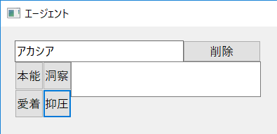
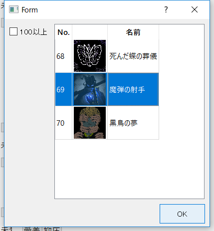

# 職員名を記入、作業とアブノーマリティを割り当てる

### 1. 「エージェント」ウィンドウで、欄上部の枠に育成したい職員の名前を記入

### 2. 職員に行わせたい作業ボタンを押す

### 3. 選択した作業に適性を持つアブノーマリティが表示されるので、割り当てたいアブノーマリティを選択、「OK」ボタンを押す

### 4. 1~3を育成したい職員全員に対して行う

※「削除」ボタンで職員名を残したままアブノーマリティの割当を解除する  
※職員を変更したい場合は名前を変更すればOK、削除は「削除」ボタンを押して名前欄を空に
